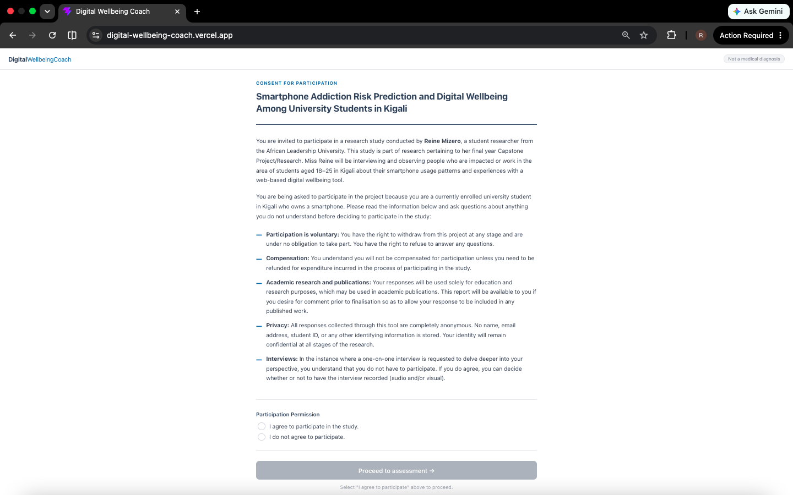
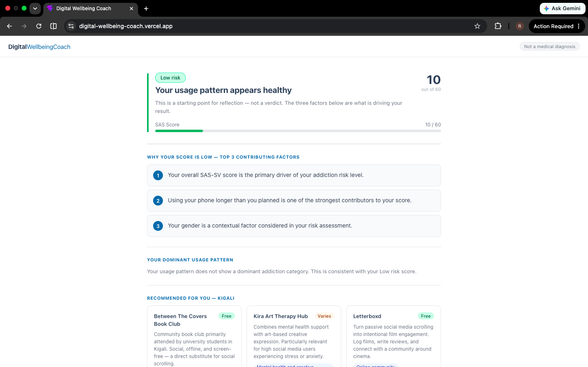
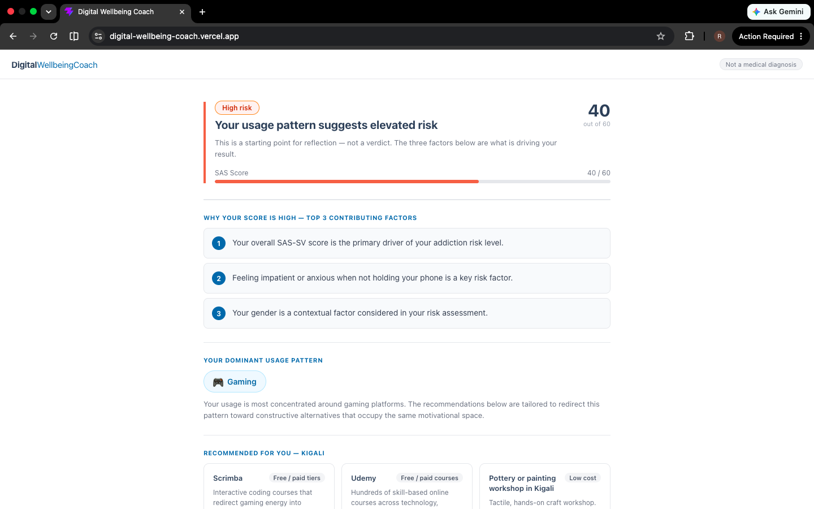
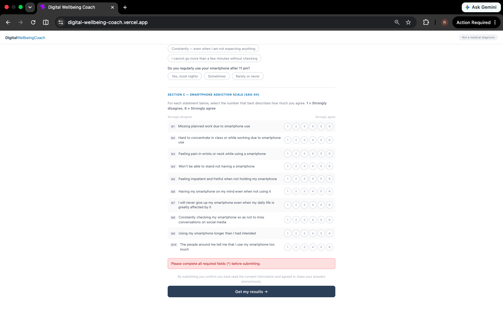
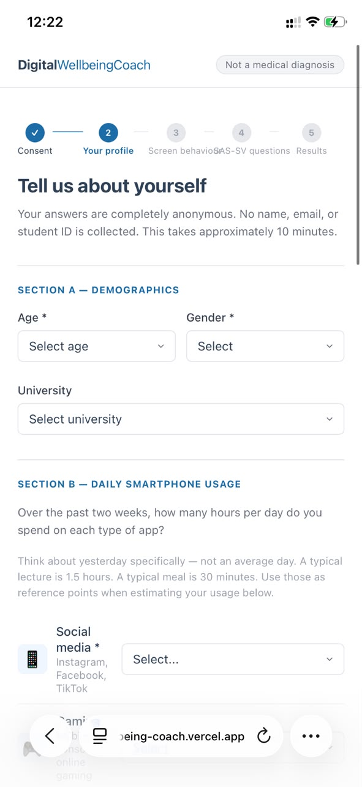

# Digital Wellbeing Coach

> A web-based smartphone addiction risk predictor and personalised intervention recommender for university students in Kigali, Rwanda.

[](https://python.org)
[](https://fastapi.tiangolo.com)
[](https://react.dev)
[](https://supabase.com)
[](LICENSE)

## Description

The Digital Wellbeing Coach is a full-stack web application that uses supervised machine learning to predict smartphone addiction risk and deliver personalised, locally relevant intervention recommendations to university students aged 18–25 in Kigali, Rwanda.

The system addresses a documented gap: no ML-based digital wellbeing tool has been developed using African behavioural data or evaluated on any African user population. It is the first tool of its kind designed specifically for this context.

**How it works:**
1. A user reads and agrees to a research consent screen before proceeding
2. They fill in a structured self-report form — demographic information, daily app usage patterns, and 10 SAS-SV questions (scored 1–6)
3. An XGBoost classifier runs on the submission; a rule-based function maps the SAS-SV total (out of 60) to a risk level — Low (≤26), Moderate (27–32), High (33–41), or Severe (42+)
4. TreeSHAP identifies the top 3 behavioural drivers of their score and converts them to plain-language coaching feedback
5. A rule-based category classifier identifies their dominant addiction pattern (Social Media, Gaming, Streaming, or General)
6. 5–10 locally relevant Kigali activity recommendations are returned from a curated resource library
7. All submissions are stored anonymously in a Supabase PostgreSQL database for research analysis

**Live Frontend:** https://digital-wellbeing-coach.vercel.app/
**Live API:** https://digital-wellbeing-coach.onrender.com
**Swagger UI:** https://digital-wellbeing-coach.onrender.com/docs

**GitHub Repository:** https://github.com/MizeroR/digital-wellbeing-coach

---

## Demo

[Watch the 5-minute demo video](https://drive.google.com/drive/folders/1JcNuJ-J8w5TfNEE0irXvVJESkuRfjKJ0?usp=sharing)

---

## Environment Setup

### 1. Run the ML notebook

**Requirements:** Python 3.10+, Jupyter Notebook or Kaggle

```bash
pip install scikit-learn xgboost shap imbalanced-learn openpyxl matplotlib seaborn pandas numpy
jupyter notebook notebooks/DWC_Model_Notebook.ipynb
```

Place `Raw Data.xlsx` in the `data/` folder before running.

### 2. Run the FastAPI backend

**Requirements:** Python 3.10+

```bash
# Install dependencies
pip install -r backend/requirements.txt

# Train the model (generates backend/model.joblib)
python backend/train_model.py

# Start the API server
uvicorn backend.main:app --reload
```

Swagger UI (interactive API docs): [http://localhost:8000/docs](http://localhost:8000/docs)

**Endpoints:**

| Method | Path | Description |
|--------|------|-------------|
| `POST` | `/predict` | Returns risk level, SAS score, SHAP explanations, and recommendations |
| `POST` | `/feedback` | Stores user star rating and optional comment |
| `GET`  | `/health`  | Liveness check |

**Example request:**
```bash
curl -X POST http://localhost:8000/predict \
  -H "Content-Type: application/json" \
  -d '{
    "gender": "F", "age": 20,
    "usage_duration": 3, "social_media_usage": 1, "frequent_access": 3,
    "Q1": 4, "Q2": 3, "Q3": 2, "Q4": 5, "Q5": 4,
    "Q6": 3, "Q7": 4, "Q8": 5, "Q9": 4, "Q10": 3
  }'
```

### 3. Run the React frontend

**Requirements:** Node.js 18+

```bash
cd frontend
npm install
npm run dev
```

Open [http://localhost:5173](http://localhost:5173)

Set the backend URL in a `.env` file if running locally:
```
VITE_API_URL=http://localhost:8000
```

---

## Designs

### System Architecture

The Digital Wellbeing Coach uses a three-tier client-server architecture:

```
User Browser
     │
     │ HTTPS
     ▼
React / Vite  ──────────────────────  Vercel (Frontend)
     │
     │ POST /predict (JSON)
     ▼
Python / FastAPI  ──────────────────  Render (Backend, Dockerised)
     │
     │ REST (supabase-py)
     ▼
PostgreSQL  ────────────────────────  Supabase (Database)
```

### Figma Mockups

Three core screens designed for the web application:

- **Screen 1 — Consent:** Research participation consent with voluntary/decline options
- **Screen 2 — Assessment Form:** Demographic questions, app usage inputs, SAS-SV questionnaire
- **Screen 3 — Results Dashboard:** Risk level, SAS score out of 60, top 3 SHAP coaching sentences, dominant addiction category, recommendations

Figma link: [View mockups](https://www.figma.com/design/Dce7R22yKo8F3dLhGrn2pM/DWC---Mockup?node-id=12-2&t=myawWubnECRM7qqu-1)

---

## Screenshots

### Consent Screen


### Risk Level Results
| Low (SAS 10/60) | Moderate (SAS 30/60) |
|---|---|
|  |  |

| High (SAS 40/60) | Severe (SAS 50/60) |
|---|---|
|  |  |

### Edge Cases
| Form Validation Error | Mobile View |
|---|---|
|  |  |

---

## Analysis

### What was achieved

All core functionalities defined in the project proposal were successfully implemented and deployed:

- Informed consent screen matching the research ethics document
- Structured self-report form collecting demographics, app usage patterns, and the validated SAS-SV questionnaire
- XGBoost classifier producing risk predictions with TreeSHAP explanations
- Rule-based addiction category classifier (Social Media, Gaming, Streaming, General)
- Curated resource library of locally relevant Kigali activity recommendations filtered by addiction category
- Anonymous data storage to Supabase PostgreSQL for research analysis
- User feedback collection (star ratings and comments)
- Full deployment: React frontend on Vercel, FastAPI backend on Render, database on Supabase

### What changed from the proposal

**Risk categorisation method:** The original design mapped the ML model's output probability to four risk levels. During testing, the binary XGBoost model consistently produced probabilities near 0% or 100%, making the four-level categorisation meaningless in practice. Analysis of the training data confirmed the model learned a near-perfect binary boundary — SAS scores below ~30 mapped to not addicted, above ~31 to addicted, with almost no overlap. The risk level was re-derived directly from the SAS-SV total score using thresholds grounded in the training data distribution (Low ≤26, Moderate 27–32, High 33–41, Severe ≥42). The ML model still runs on every submission and its probability is stored in the database as a secondary signal.

### Identified limitations

**Training data age mismatch:** The dataset used to train the XGBoost model contains respondents aged 11–16 — school children, not university students aged 18–25 as targeted by this tool. While smartphone addiction behavioural patterns may generalise across age groups, this is a limitation that affects the strict validity of the model for the target population. Future work should collect and train on data from Rwandan university students directly.

**Addiction category default:** When a user reports equal usage across all app types, the rule-based classifier defaults to Social Media because it appears first in the evaluation order. This was identified during testing and addressed by suppressing the category label entirely for Low risk results, where assigning a dominant pattern to a minimal user is misleading.

---

## Testing

### Risk level test cases

The risk level is derived from the SAS-SV total score (sum of Q1–Q10, max 60). The following inputs produce predictable, verifiable results:

| Test | All Q answers | SAS Total | Expected risk level |
|------|--------------|-----------|---------------------|
| Low | 1 on all 10 questions | 10 / 60 | **Low** |
| Moderate | 3 on all 10 questions | 30 / 60 | **Moderate** |
| High | 4 on all 10 questions | 40 / 60 | **High** |
| Severe | 5 on all 10 questions | 50 / 60 | **Severe** |

### API endpoint testing

```bash
# Health check
curl https://digital-wellbeing-coach.onrender.com/health

# Low risk prediction
curl -X POST https://digital-wellbeing-coach.onrender.com/predict \
  -H "Content-Type: application/json" \
  -d '{"gender":"M","age":25,"usage_duration":1,"social_media_usage":0,"frequent_access":1,"Q1":1,"Q2":1,"Q3":1,"Q4":1,"Q5":1,"Q6":1,"Q7":1,"Q8":1,"Q9":1,"Q10":1}'

# Severe risk prediction
curl -X POST https://digital-wellbeing-coach.onrender.com/predict \
  -H "Content-Type: application/json" \
  -d '{"gender":"F","age":18,"usage_duration":4,"social_media_usage":1,"frequent_access":3,"Q1":6,"Q2":6,"Q3":6,"Q4":6,"Q5":6,"Q6":6,"Q7":6,"Q8":6,"Q9":6,"Q10":6}'
```

### Database verification

All submissions are stored in the Supabase `assessment` table with the following fields: session ID, age, gender, university, usage patterns, Q1–Q10 responses, SAS total, risk level, ML confidence, and addiction category. User feedback (star ratings) is stored in the `feedback` table.

---

## Deployment Plan

| Layer | Service | Method |
|-------|---------|--------|
| Frontend | Vercel | Auto-deploy from GitHub (`frontend/` directory) |
| Backend | Render | Docker — root `Dockerfile` auto-detected |
| Database | Supabase | PostgreSQL with RLS disabled; service_role key via env vars |

**Environment variables required on Render:**

| Variable | Description |
|----------|-------------|
| `SUPABASE_URL` | Supabase project URL |
| `SUPABASE_KEY` | Supabase service_role key |

**To redeploy:**
1. Connect this GitHub repo on [render.com](https://render.com)
2. Select **Deploy from Dockerfile** — no additional config needed
3. Add `SUPABASE_URL` and `SUPABASE_KEY` in Render environment variables
4. Verify: `GET /health` → `{"status":"ok","model_loaded":true}`

**Live Frontend:** https://digital-wellbeing-coach.vercel.app/
**Live API:** https://digital-wellbeing-coach.onrender.com
**Swagger UI:** https://digital-wellbeing-coach.onrender.com/docs
**Health check:** https://digital-wellbeing-coach.onrender.com/health

---

## Author

**Reine Mizero**
BSc Software Engineering — African Leadership University, Kigali, Rwanda
